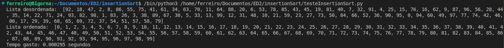
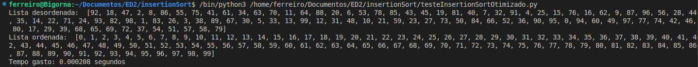

# 🏎️ Comparação de Desempenho do Algoritmo Insertion Sort

## 📖 Introdução
Este projeto tem como objetivo analisar a diferença de desempenho entre o insertion sort e o insertion sort otimização. Foram realizados testes para medir o tempo de execução.
## ⚙️ Como o Algoritmo Funciona
O algoritmo segue os seguintes passos:

1. **Entrada**: recebe uma lista de 100 elementos.
2. **Processamento**: executa a ordenação usando o método insertion sort.
3. **Saída**: retorna a lista ordenada e o tempo de execução.

O código foi implementado em Python.

## ⏳ Comparação de Tempo de Execução

Os testes foram feitos em diferentes tamanhos de entrada. Os resultados podem ser observados abaixo:

### 📌 **Insertio Sort**  

### 📌 **Insertion Sort Otimizado**  

## 🔬 Análise dos Resultados
A partir dos testes, podemos observar que mesmo com uma diferença mínima no código o tempo de execução do programa muda muito.
